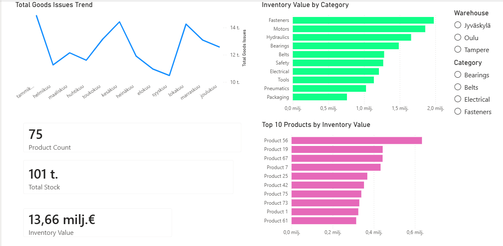
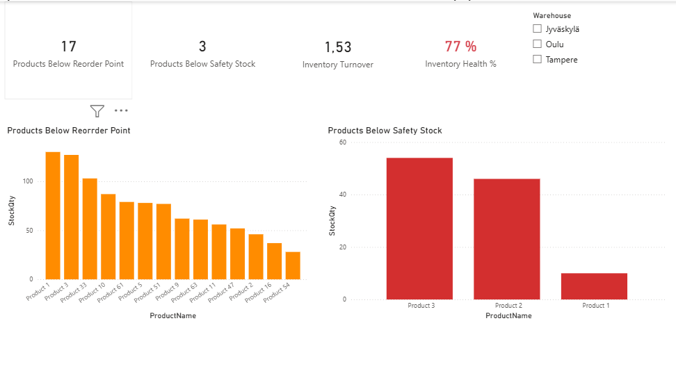
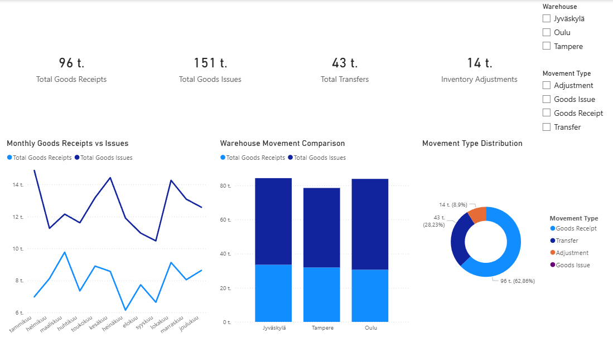
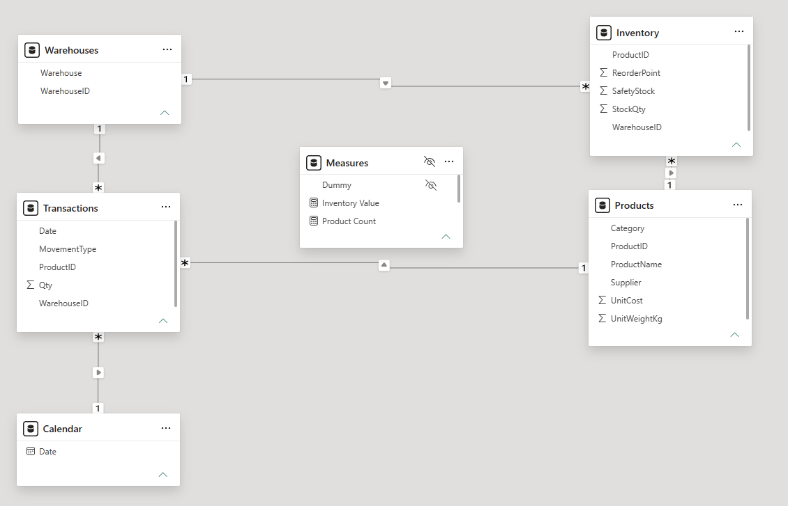

# Warehouse Performance Dashboard

## Overview

This project demonstrates how Power BI can be used to analyze warehouse operations and inventory performance.

## Business Problem

Companies often have significant capital tied up in inventory. This dashboard helps identify:

- Inventory value
- Inventory turnover
- Slow moving items
- Category performance

## Tools Used

- Power BI
- Power Query
- DAX
- Excel

## Dashboard Preview

## Inventory Analysis

## Warehouse Operations

## Data Model

